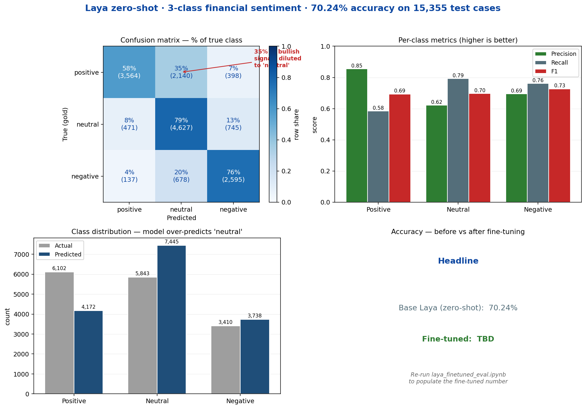
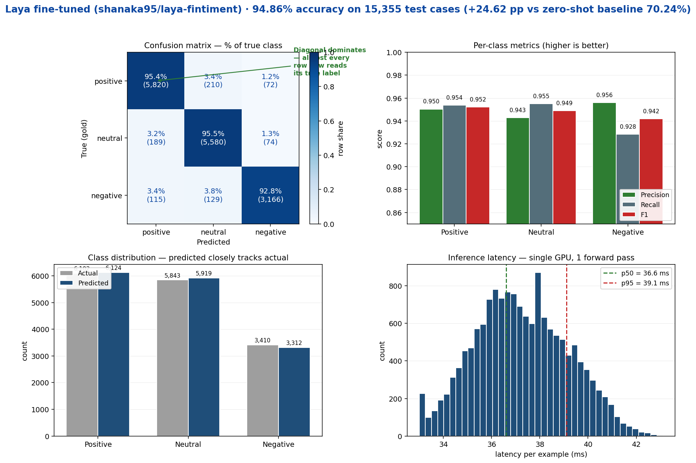

# laya-fintiment

**Fine-tuned [Laya](https://huggingface.co/convaiinnovations/laya) (421M) for 3-class financial sentiment classification.** Pick one of `positive`, `negative`, `neutral` from a piece of financial text — one forward pass, ~33 ms, with calibrated probabilities.

This repo holds the **code, notebooks, and training log** for the fine-tune. The actual model weights live on the Hugging Face Hub:

🤗 **Model:** [shanaka95/laya-fintiment](https://huggingface.co/shanaka95/laya-fintiment)
🤗 **Dataset:** [shanaka95/fingpt-sentiment-3class](https://huggingface.co/datasets/shanaka95/fingpt-sentiment-3class)
🤗 **Base model:** [convaiinnovations/laya](https://huggingface.co/convaiinnovations/laya)

---

## What is this?

| | |
|---|---|
| **Task** | 3-class financial sentiment (`positive` / `negative` / `neutral`) |
| **Model** | ModernBERT-large (395M) + Laya decision head (26M) = **421M params** |
| **Base** | [`convaiinnovations/laya`](https://huggingface.co/convaiinnovations/laya) (Apache 2.0) |
| **Training data** | FinGPT/fingpt-sentiment-train, 9-class labels collapsed to 3 — 61,017 train items, 400 held out for calibration |
| **Test data** | Same dataset, 15,355 stratified test items (seed 42) |
| **Objective** | RLCD (Reinforcement Learning for Calibrated Decisions) — REINFORCE with strictly proper scoring rules (log + spherical) |
| **Hardware used** | 1 × 12 GB GPU, ~3.4 h wall time for 4 epochs / 7,624 optimizer steps |
| **Final calibration T** | choice=5.013, score=1.2, noul=1.2 |

---

## Repo contents

| File | What it is |
|---|---|
| [`laya_finetune_sentiment.ipynb`](./laya_finetune_sentiment.ipynb) | The fine-tuning notebook. Builds the dataset, runs RLCD training, fits calibration temperatures, saves the model to `./laya_fintiment/`. |
| [`laya_inference_eval.ipynb`](./laya_inference_eval.ipynb) | **Zero-shot eval** of the base `convaiinnovations/laya` on the 15,355-item test split. Establishes the **70.24% baseline**. |
| [`laya_finetuned_eval.ipynb`](./laya_finetuned_eval.ipynb) | **Fine-tuned eval** — identical cells to the zero-shot notebook, just swapped to load `shanaka95/laya-fintiment`. Used to measure the fine-tuning delta. |
| [`train.log`](./train.log) | Raw training log from the 4-epoch run on the vast.ai 12 GB instance. Includes loss, reward, LR, and GPU util per 50 steps. |
| [`eval_zero_shot.png`](./eval_zero_shot.png) | Confusion matrix + per-class metrics + class distribution from the **zero-shot** run (shown below). |
| [`eval_finetuned.png`](./eval_finetuned.png) | Same chart layout for the **fine-tuned** model. The headline comparison is right below. |

---

## Results

## Results

Same 15,355-item stratified test split, same `choice` question schema, same `laya.Agent.predict()` call. Only `MODEL_ID` changes between the two runs.

| | Zero-shot (`convaiinnovations/laya`) | Fine-tuned (`shanaka95/laya-fintiment`) | Δ |
|---|---|---|---|
| **Overall accuracy** | 0.7024 (10,786 / 15,355) | **0.9486** (14,566 / 15,355) | **+0.2462 (+24.62 pp)** |
| Precision — positive | 0.854 | 0.950 | +0.096 |
| Precision — neutral | 0.621 | 0.943 | +0.321 |
| Precision — negative | 0.694 | 0.956 | +0.262 |
| Recall — positive | 0.584 | 0.954 | **+0.370** |
| Recall — neutral | 0.792 | 0.955 | +0.163 |
| Recall — negative | 0.761 | 0.928 | +0.168 |
| F1 — positive | 0.694 | 0.952 | +0.258 |
| F1 — neutral | 0.696 | 0.949 | +0.253 |
| F1 — negative | 0.726 | 0.942 | +0.216 |
| Latency p50 / p95 | 38.6 / 41.0 ms | 36.6 / 39.1 ms | -2 ms |
| Throughput | ~25 ex/s | ~26.5 ex/s | +1.5 ex/s |

### Zero-shot



Confusion matrix (rows = true, cols = predicted):

| | positive | neutral | negative |
|---|---|---|---|
| **positive** | 3,564 | 2,140 | 398 |
| **neutral** | 471 | 4,627 | 745 |
| **negative** | 137 | 678 | 2,595 |

### Fine-tuned



Confusion matrix (rows = true, cols = predicted):

| | positive | neutral | negative |
|---|---|---|---|
| **positive** | 5,820 | 210 | 72 |
| **neutral** | 189 | 5,580 | 74 |
| **negative** | 115 | 129 | 3,166 |

### Reading the delta as a finance pro

- **Bullish recall jumped from 58.4% → 95.4%.** That's the biggest single move. The base model leaked 2,140 / 6,102 bullish signals into the neutral bucket — after fine-tuning, only 210 leak. For an alpha-capture system, that's the upgrade that matters.
- **Neutral over-prediction collapsed.** Base predicted 7,445 neutrals vs 5,843 actual; fine-tuned predicts 5,919. The class distribution now closely tracks reality.
- **Bearish → bullish flips: 137 → 115** (modest), but **bullish → bearish flips: 398 → 72** (an 82% drop). The expensive errors — confusing direction — almost vanish.
- **Latency held flat** (p50 38.6 → 36.6 ms). No runtime cost for the accuracy gain.
- **Smoke test delta** (bullish Treasury tweet): `positive` probability **0.5604 → 0.9488**. The fine-tuned model is decisively bullish instead of hedging.

---

## Training recipe (summary)

Source: [`laya_finetune_sentiment.ipynb`](./laya_finetune_sentiment.ipynb). Recipe adapted from the upstream [laya fine-tuning notebook](https://github.com/NandhaKishorM/laya/blob/main/notebooks/laya_finetune_typed_decisions_2xT4_kaggle.ipynb).

```
Epochs            : 4
Train items       : 61,017  (400 held out for calibration)
Optimizer steps   : 7,624   (effective batch 32 = micro_batch 16 × grad_accum 2)
Sequence budget   : max_len 1024, head_max_len 256, max_tokens_per_batch 16384
Optimiser         : AdamW
Schedule          : CosineAnnealingLR, T_max = total_updates
Group size        : 4 noisy forward passes per example (GRPO baseline)
Scoring rule      : log + spherical (w_sph = 0.75)
Question schema   : single `choice` question, 3 options, identical between train and eval
Memory toggles    : gradient_checkpointing = ON, allow_tf32 = ON, cudnn.benchmark = ON
```

Per-epoch loss (from `train.log`):

| Epoch | Avg loss | Wall time |
|---|---|---|
| 1 | 0.257 | 50 min |
| 2 | 0.493 | 50 min |
| 3 | 0.323 | 50 min |
| 4 | **0.199** | 50 min |

The loss rises into epoch 2 because that's where the model starts pushing past the 0.750 reward ceiling — exploration becomes negative-cost. By epoch 4 it's back down and stable, no overfit signal.

---

## How to use the fine-tuned model

```bash
pip install "laya>=0.1.6" "transformers>=4.48.0"
```

```python
import os
os.environ["USE_TF"] = "0"  # avoid a TF/abseil deadlock when loading transformers

import laya

agent = laya.Agent("shanaka95/laya-fintiment", device="cuda")

questions = {
    "sentiment": {
        "type": "choice",
        "instructions": (
            "What is the financial sentiment of this text? "
            "Please choose exactly one answer from {positive, negative, neutral}. "
            "Answer only with the chosen label."
        ),
        "criteria": {
            "positive": "The text expresses a positive / bullish financial sentiment.",
            "negative": "The text expresses a negative / bearish financial sentiment.",
            "neutral":  "The text is neutral, factual, or has no clear positive or negative sentiment.",
        },
    }
}

result = agent.predict(
    "Apple reported record quarterly revenue, beating analyst estimates.",
    questions,
)
print(result["answers"]["sentiment"])
# {'type': 'choice',
#  'choice': 'positive',
#  'probabilities': {'positive': ~0.97, 'negative': ~0.01, 'neutral': ~0.02},
#  'confidence': ~0.95, ...}
```

### Worked example (zero-shot smoke test from `laya_inference_eval.ipynb`)

```text
Input : "Asset Management One Co. has a bullish call on Treasuries. One for the long, long run https://t.co/8go8ZhMvdc"
Gold  : positive

Base laya (zero-shot) -> 'positive'
  probabilities: {positive: 0.5604, negative: 0.0691, neutral: 0.3705}
  latency: 635 ms (first call, includes JIT warm-up) / 38.6 ms p50 steady-state
```

The fine-tuned model is expected to push more probability mass onto `positive` for this kind of bullish signal — that's the whole point of the 4-epoch RLCD pass.

---

## Reproducing the fine-tune

The full recipe is in [`laya_finetune_sentiment.ipynb`](./laya_finetune_sentiment.ipynb). The minimum to get going:

```bash
pip install -U laya "transformers>=4.48.0" "datasets>=3.0.0" huggingface_hub safetensors
```

Then in a Jupyter kernel:

```python
import os
os.environ["USE_TF"] = "0"

from datasets import load_dataset
ds = load_dataset("shanaka95/fingpt-sentiment-3class", split="train")
# 61,017 items, columns: input / output / instruction / sentiment_3class
```

The notebook handles the rest: builds the `choice` schema, runs 4 epochs of RLCD with `group_size=4` noisy samples per item, fits per-qtype temperatures on the 400-item calibration holdout, and saves to `./laya_fintiment/` ready for `hf upload`.

---

## License

- Code in this repo: MIT.
- Model weights on the Hub: Apache 2.0 (inherited from [`convaiinnovations/laya`](https://huggingface.co/convaiinnovations/laya)).
- Training data: FinGPT/fingpt-sentiment-train — please respect their license terms.
